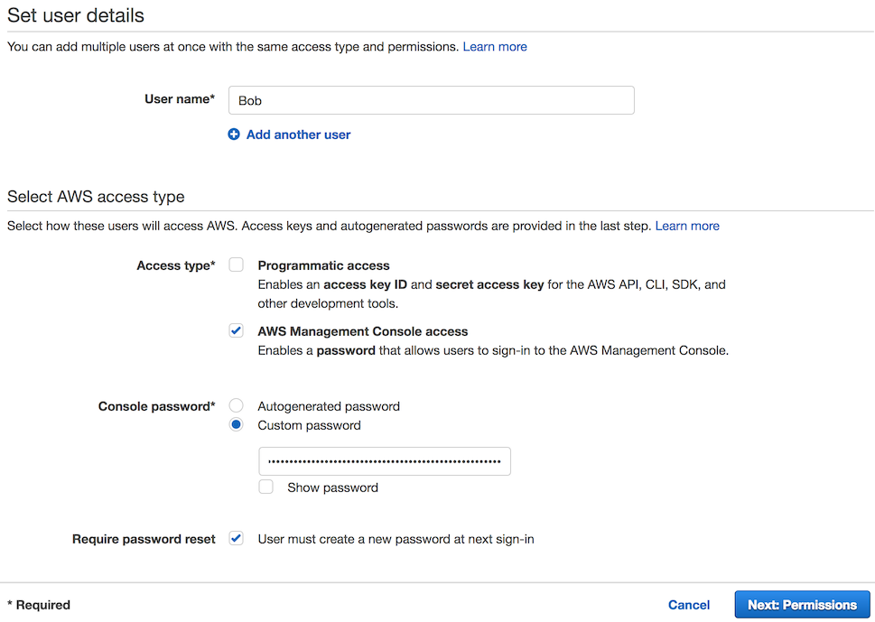
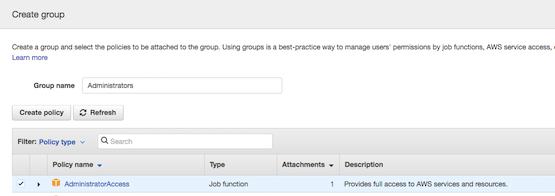
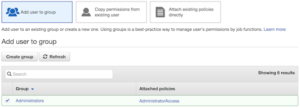
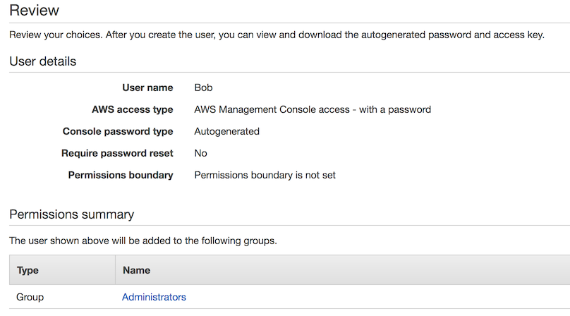

# Level 100: Basic Identity & Access Management User, Group, Role: Lab Guide

## 1. AWS Identity & Access Management
As a best practice, do not use the AWS account root user for any task where it's not required. Instead, create a new IAM user for each person that requires administrator access. Then make those users administrators by placing the users into an "Administrators" group to which you attach the AdministratorAccess managed policy.
Thereafter, the users in the administrators group should assume a role to perform their tasks for the AWS account. All future interaction should be through the AWS account's users assuming roles, instead of the IAM user directly or the root user.

### 1.1 Create Administrator IAM User and Group
To create an administrator user for yourself and add the user to an administrators group:

1. Use your AWS account email address and password to sign in as the AWS account root user to the IAM console at [https://console.aws.amazon.com/iam/](https://console.aws.amazon.com/iam/).
2. In the navigation pane, choose Users and then choose Add user.  
  
3. For User name, type a user name, such as Administrator. The name can consist of letters, digits, and the following characters: plus `(+)`, equal `(=)`, comma `(,)`, period `(.)`, at `(@)`, underscore `(_)`, and hyphen `(-)`. The name is not case sensitive and can be a maximum of 64 characters in length.
4. Select the check box next to AWS Management Console access, select Custom password, and then type your new password in the text box. For this highly privileged user it is not recommended to enable programmatic access, if you do not protect the access and secret keys that are generated then someone could gain access to your resources. If you're creating the user for someone other than yourself, you can optionally select Require password reset to force the user to create a new password when first signing in.
  
5. Choose Next: Permissions.
6. On the Set permissions for user page, choose Add user to group.
7. Choose Create group.
8. In the Create group dialog box, type the name for the new group such as Administrators. The name can consist of letters, digits, and the following characters: `plus (+), equal (=), comma (,), period (.), at (@), underscore (_), and hyphen (-).` The name is not case sensitive and can be a maximum of 128 characters in length.
9. In the policy list, select the check box next to AdministratorAccess. Then choose Create group.   
10. Back in the list of groups, verify the check box is next to your new group. Choose Refresh if necessary to see the group in the list.   
11. Choose Next: Review to see the list of group memberships to be added to the new user. When you are ready to proceed, choose Create user.
  
You can use this same process to create more groups and users and to give your users access to your AWS account resources. To learn about using policies that restrict user permissions to specific AWS resources, see [Access Management](https://docs.aws.amazon.com/IAM/latest/UserGuide/access.html) and [Example Policies](https://docs.aws.amazon.com/IAM/latest/UserGuide/access_policies_examples.html). To add users to the group after it's created, see [Adding and Removing Users in an IAM Group](https://docs.aws.amazon.com/IAM/latest/UserGuide/id_groups_manage_add-remove-users.html).
12. Configure MFA on your new administrator user by choosing Users from the navigation pane.
13. In the User Name list, choose the name of the intended MFA user.
14. Choose the Security credentials tab. Next to Assigned MFA device, choose the edit icon.
  
15. You can now use this administrator user instead of your root user for this AWS account. In the following steps we will further secure this administrator user. It is a best practice to use least a least privileged approach to granting permissions, not everyone needs full administrator access!

### 1.2 Create Administrator IAM Role
To create an administrator role for yourself (and other administrators) to be used with the administrator user and group you just created:
1. Sign in to the AWS Management Console and open the IAM console at [https://console.aws.amazon.com/iam/](https://console.aws.amazon.com/iam/).
2. In the navigation pane, click Credential report.

### 1.3 Create Administrator IAM Role
To create an administrator role for yourself (and other administrators) to be used with the administrator user and group you just created:
1. Sign in to the AWS Management Console and open the IAM console at [https://console.aws.amazon.com/iam/](https://console.aws.amazon.com/iam/).
2. In the navigation pane, click Credential report.

## 2. Assume Roles from an IAM user
We will assume the roles previously created in the web console and command line interface (CLI) using an existing IAM user.

### 2.1 Use Restricted Administrator Role in Web Console
A *role* specifies a set of permissions that you can use to access AWS resources that you need. In that sense, it is similar to a user in AWS Identity and Access Management (IAM). When you sign in as a user, you get a specific set of permissions. However, you don't sign in to a role, but once signed in (as a user) you can switch to a role. This temporarily sets aside your original user permissions and instead gives you the permissions assigned to the role. The role can be in your own account or any other AWS account. By default, your AWS Management Console session lasts for one hour.

  **Important**

    The permissions of your IAM user and any roles that you switch to are not cumulative. Only one set of permissions is active at a time. When you switch to a role, you temporarily give up your user permissions and work with the permissions that are assigned to the role. When you exit the role, your user permissions are automatically restored.

1. Sign in to the AWS Management Console as an IAM user [https://console.aws.amazon.com](https://console.aws.amazon.com).
2. In the IAM console, choose your user name on the navigation bar in the upper right. It typically looks like this: `username@account_ID_number_or_alias`.
3. Choose Switch Role. If this is the first time choosing this option, a page appears with more information. After reading it, choose Switch Role. If you clear your browser cookies, this page can appear again.
4. On the Switch Role page, type the account ID number or the account alias and the name of the role that you created for the Restricted Admin in the previous step, for example, `arn:aws:iam::account_ID:role/Baseline-RestrictedAdmin`.
5. (Optional) Type text that you want to appear on the navigation bar in place of your user name when this role is active. A name is suggested, based on the account and role information, but you can change it to whatever has meaning for you. You can also select a color to highlight the display name. The name and color can help remind you when this role is active, which changes your permissions. For example, for a role that gives you access to the test environment, you might specify a Display Name of Test and select the green Color. For the role that gives you access to production, you might specify a Display Name of Production and select red as the Color.
6. Choose Switch Role. The display name and color replace your user name on the navigation bar, and you can start using the permissions that the role grants you.

    **Tip**

	The last several roles that you used appear on the menu. The next time you need to switch to one of those roles, you can simply choose the role you want. You only need to type the account and role information manually if the role is not displayed on the Identity menu.
7. You are now using the role with the granted permissions!
	**To stop using a role**
    In the IAM console, choose your role's Display Name on the right side of the navigation bar.
    Choose Back to UserName. The role and its permissions are deactivated, and the permissions associated with your IAM user and groups are automatically restored.

### 2.2 Use Restricted Administrator Role in Command Line Interface (CLI)
Coming soon, for now check out: [https://docs.aws.amazon.com/cli/latest/userguide/cli-roles.html](https://docs.aws.amazon.com/cli/latest/userguide/cli-roles.html)

***

### 3. Tear down this lab
The following instructions will remove the resources that have a cost for running them. Please note that
the changes you made to the root login, users, groups, and policies have no charges associated with them.

***

## References & useful resources:
[AWS Identity and Access Management User Guide](https://docs.aws.amazon.com/IAM/latest/UserGuide/introduction.html)  
[IAM Best Practices and Use Cases](https://docs.aws.amazon.com/IAM/latest/UserGuide/IAMBestPracticesAndUseCases.html)  

***

## License
Licensed under the Apache 2.0 and MITnoAttr License. 

Copyright 2018 Amazon.com, Inc. or its affiliates. All Rights Reserved.

Licensed under the Apache License, Version 2.0 (the "License"). You may not use this file except in compliance with the License. A copy of the License is located at

    http://aws.amazon.com/apache2.0/

or in the "license" file accompanying this file. This file is distributed on an "AS IS" BASIS, WITHOUT WARRANTIES OR CONDITIONS OF ANY KIND, either express or implied. See the License for the specific language governing permissions and limitations under the License.
