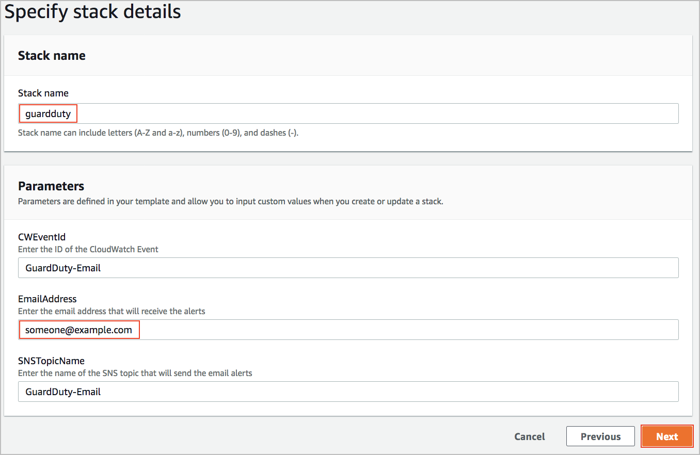
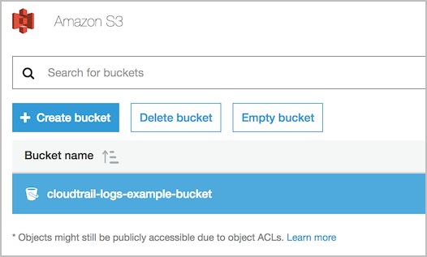
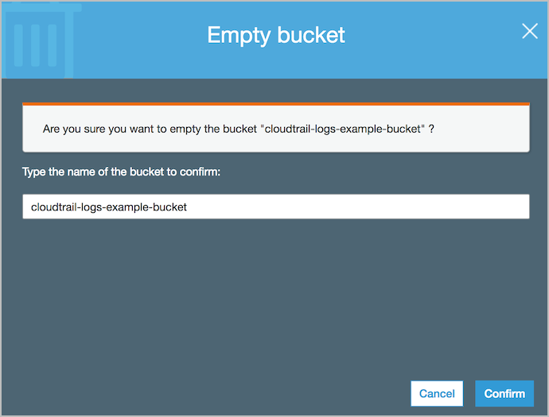
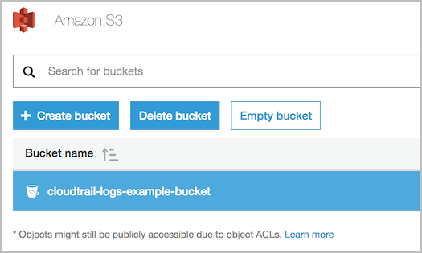
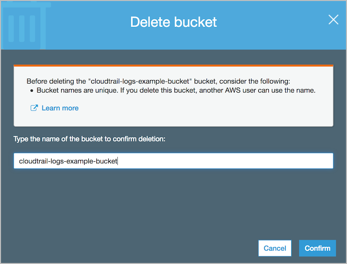

# Level 200: Automated Deployment of Detective Controls: Lab Guide

### 1. AWS CloudFormation to Configure Customized AWS CloudTrail
[AWS CloudTrail](https://aws.amazon.com/cloudtrail/) is a service that enables governance, compliance, operational auditing, and risk auditing of your AWS account. With CloudTrail, you can log, continuously monitor, and retain account activity related to actions across your AWS infrastructure. CloudTrail provides event history of your AWS account activity, including actions taken through the AWS Management Console, AWS SDKs, command line tools, and other AWS services.
Using [AWS CloudFormation](https://aws.amazon.com/cloudformation/), we are going to create a new Amazon
S3 bucket, and configure CloudTrail to send events to the bucket and to [Amazon CloudWatch Logs](https://aws.amazon.com/cloudwatch/)
for further analysis.

1. Sign in to the AWS Management Console, select your preferred region, and open the CloudFormation console at https://console.aws.amazon.com/cloudformation/.
2. Click Create New Stack.
3. Select Specify an Amazon S3 template URL and enter the following URL for the template: `https://s3-us-west-2.amazonaws.com/aws-well-architected-labs/Security/Code/baseline-cloudtrail.yaml` and click Next.
4. Enter the following details:
  * Stack name: The name of this stack. For this lab, use `cloudtrail`.
  * CloudTrailBucketName: The name of the new S3 bucket to create for CloudTrail to send logs to.  **IMPORTANT** Specify a bucket name that is unique. The default bucket name likely has already been created.  
  * S3AccessLogsBucketName: The name of an existing S3 bucket for storing S3 access logs (optional).
  * CloudWatchLogsRetentionTime: Number of days to retain logs in CloudWatch Logs.
  * EncryptLogs: (optional) Use AWS KMS to encrypt logs stored in Amazon S3. A new KMS key will be created.
  * BucketPolicyExplicitDeny: (optional) Explicitly deny destructive actions to the bucket. AWS root user will be required to modify this bucket if configured.
  * ExpirationDays: Number of days to retain logs in the S3 bucket before they are automatically deleted.

5. Click Next.
6. In this lab, we won't add any tags or other options. Click Next. Tags, which are key-value pairs, can help you identify your stacks. For more information, see [Adding Tags to Your AWS CloudFormation Stack](http://docs.aws.amazon.com/AWSCloudFormation/latest/UserGuide//cfn-console-add-tags.html).
7. Review the information for the stack. When you're satisfied with the settings, click Next.
8. Select I acknowledge that AWS CloudFormation might create IAM resources with custom names, and click Create.
9. After a few minutes the stack status should change from CREATE_IN_PROGRESS to CREATE_COMPLETE.
You have now set up CloudTrail to log to your bucket and retain events, giving you the ability to search history and later enable pro-active monitoring of your AWS account!

### 2. AWS CloudFormation to Configure Amazon GuardDuty
[Amazon GuardDuty](https://aws.amazon.com/guardduty/) is a threat detection service that continuously monitors for malicious or unauthorized behavior to help you protect your AWS accounts and workloads. It monitors for activity such as unusual API calls or potentially unauthorized deployments that indicate a possible account compromise. GuardDuty also detects potentially compromised instances or reconnaissance by attackers.
Using [AWS CloudFormation](https://aws.amazon.com/cloudformation/), we are going to configure GuardDuty, and configure alerting to your email address.

1. Sign in to the AWS Management Console, select your preferred region, and open the CloudFormation console at https://console.aws.amazon.com/cloudformation/.
2. Click Create New Stack.
3. Select Specify an Amazon S3 template URL and enter the following URL for the template: `https://s3-us-west-2.amazonaws.com/aws-well-architected-labs/Security/Code/baseline-guardduty.yaml` and click Next.
4. Enter the following details:
  * Stack name: The name of this stack. For this lab, use `guardduty`.
  * CWEventId: The event Id for CloudWatch, leave as default.
  * EmailAddress: The email address you own that will receive the alerts, you must have access to this address for testing.
  * SNSTopicName: The name of the SNS topic to create, leave as default.

5. Click Next.
6. In this lab, we won't add any tags or other options. Click Next.
7. Review the information for the stack. When you're satisfied with the settings, click Create.
9. After a few minutes the stack status should change from CREATE_IN_PROGRESS to CREATE_COMPLETE.
10. You should receive an email to confirm the SNS email subscription, you must confirm this.
You have now set up GuardDuty to detect threats and email alerts.

***

### 3. Tear down this lab
The following instructions will remove the resources that have a cost for running them.

Delete the CloudTrail stack:
1. Sign in to the AWS Management Console, and open the CloudFormation console at https://console.aws.amazon.com/cloudformation/.
2. Select the `cloudtrail` stack.
3. Click the Actions button then click Delete Stack.
4. Confirm the stack and then click the Yes, Delete button.

Empty and delete the CloudTrail bucket:
1. Sign in to the AWS Management Console, and open the S3 console at https://console.aws.amazon.com/s3/.
2. Select the bucket name you previously created without clicking the name.
  
3. Click Empty bucket and enter the bucket name in the confirmation box.  
  
4. Click Confirm and the bucket will be emptied when the bottom task bar has 0 operations in progress.  
  
5. With the bucket now empty, click Delete bucket.

6. Enter the bucket name in the confirmation box and click Confirm.
  
7. The bucket will then be removed from the console.

Delete the GuardDuty stack:
1. Sign in to the AWS Management Console, and open the CloudFormation console at https://console.aws.amazon.com/cloudformation/.
2. Select the `guardduty` stack.
3. Click the Actions button then click Delete Stack.
4. Confirm the stack and then click the Yes, Delete button.

***

## References & useful resources:
[AWS CloudTrail User Guide](https://docs.aws.amazon.com/awscloudtrail/latest/userguide/cloudtrail-user-guide.html)  
[AWS CloudFormation User Guide](https://docs.aws.amazon.com/AWSCloudFormation/latest/UserGuide/Welcome.html)  

***

## License
Licensed under the Apache 2.0 and MITnoAttr License. 

Copyright 2018 Amazon.com, Inc. or its affiliates. All Rights Reserved.

Licensed under the Apache License, Version 2.0 (the "License"). You may not use this file except in compliance with the License. A copy of the License is located at

    http://aws.amazon.com/apache2.0/

or in the "license" file accompanying this file. This file is distributed on an "AS IS" BASIS, WITHOUT WARRANTIES OR CONDITIONS OF ANY KIND, either express or implied. See the License for the specific language governing permissions and limitations under the License.
